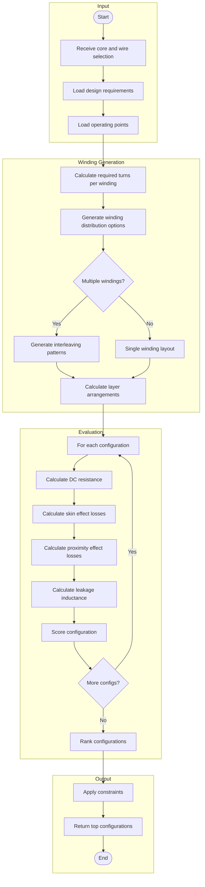

# Coil Adviser

The Coil Adviser optimizes winding configurations for a given core and wire combination, minimizing losses while meeting electrical requirements.

## Overview

The Coil Adviser works in conjunction with the Wire Adviser to find optimal winding configurations. It considers turn placement, layer organization, and interleaving strategies.



## Key Features

### Turn Calculation

The adviser calculates the required number of turns based on:

- Magnetizing inductance requirement
- Core reluctance (from selected reluctance model)
- Turns ratio for transformers

$$N = \sqrt{L \cdot R_{total}}$$

Where:
- L = required inductance
- R_total = total magnetic reluctance

### Winding Distribution

For multi-winding designs, the adviser explores:

1. **Stacked windings**: Each winding in its own section
2. **Interleaved windings**: Primary-secondary-primary patterns
3. **Sectioned windings**: Split windings for reduced leakage

### Layer Optimization

The adviser optimizes layer arrangement considering:

- Wire dimensions and spacing
- Insulation requirements
- Manufacturing constraints
- Loss minimization

## Configuration

### Settings

```cpp
auto& settings = OpenMagnetics::Settings::GetInstance();

// Maximum wires to consider from WireAdviser
settings.set_coil_adviser_maximum_number_wires(100);

// Allow margin tape between windings
settings.set_coil_allow_margin_tape(true);

// Allow pre-insulated wire
settings.set_coil_allow_insulated_wire(true);

// Try to fit even if marginal
settings.set_coil_wind_even_if_not_fit(false);

// Equalize margins on both sides
settings.set_coil_equalize_margins(true);

// Maximum layers for planar transformers
settings.set_coil_maximum_layers_planar(4);
```

### Winding Preferences

```cpp
OpenMagnetics::CoilAdviser adviser;

// Prefer fewer layers
adviser.set_layer_weight(0.3);

// Minimize proximity losses
adviser.set_proximity_weight(0.4);

// Minimize leakage inductance
adviser.set_leakage_weight(0.3);
```

## Usage Example

```cpp
#include "OpenMagnetics.h"

int main() {
    // Load a core
    auto core = OpenMagnetics::find_core_by_name("E 42/21/15");

    // Define winding requirements
    MAS::DesignRequirements requirements;
    requirements.set_magnetizing_inductance(100e-6);

    // Add turns ratio for transformer
    std::vector<double> turnsRatios = {1.0, 0.1};  // 10:1 ratio
    requirements.set_turns_ratios(turnsRatios);

    // Operating point
    MAS::OperatingPoint operatingPoint;
    MAS::OperatingConditions conditions;
    conditions.set_ambient_temperature(25);
    operatingPoint.set_conditions(conditions);

    MAS::OperatingPointExcitation excitation;
    excitation.set_frequency(100000);
    operatingPoint.set_excitations_per_winding({excitation, excitation});

    // Run coil adviser
    OpenMagnetics::CoilAdviser adviser;
    auto coils = adviser.get_advised_coil(core, requirements, operatingPoint, 10);

    for (const auto& coil : coils) {
        std::cout << "Configuration:" << std::endl;
        std::cout << "  Layers: " << coil.get_layers().size() << std::endl;
        std::cout << "  Estimated losses: " << coil.get_estimated_losses() << " W" << std::endl;
    }

    return 0;
}
```

## Interleaving Strategies

For transformers, interleaving reduces leakage inductance and proximity losses:

### No Interleaving (P-S)
```
┌─────────────────────┐
│     Primary (P)     │
├─────────────────────┤
│    Secondary (S)    │
└─────────────────────┘
```
- Highest leakage inductance
- Simplest manufacturing

### Simple Interleaving (P-S-P)
```
┌─────────────────────┐
│   Primary (P/2)     │
├─────────────────────┤
│    Secondary (S)    │
├─────────────────────┤
│   Primary (P/2)     │
└─────────────────────┘
```
- Reduced leakage
- Moderate complexity

### Full Interleaving (P-S-P-S-...)
```
┌─────────────────────┐
│   Primary (P/n)     │
├─────────────────────┤
│  Secondary (S/n)    │
├─────────────────────┤
│   Primary (P/n)     │
├─────────────────────┤
│  Secondary (S/n)    │
└─────────────────────┘
```
- Minimum leakage
- Most complex manufacturing

## Loss Calculation

The adviser estimates losses for each configuration:

### DC Resistance
$$R_{DC} = \rho \frac{l}{A}$$

### AC Resistance (Skin + Proximity)
$$R_{AC} = R_{DC} \cdot F_r$$

Where Fr is the resistance factor accounting for skin and proximity effects.

### Total Winding Loss
$$P_{winding} = I_{rms}^2 \cdot R_{AC}$$
