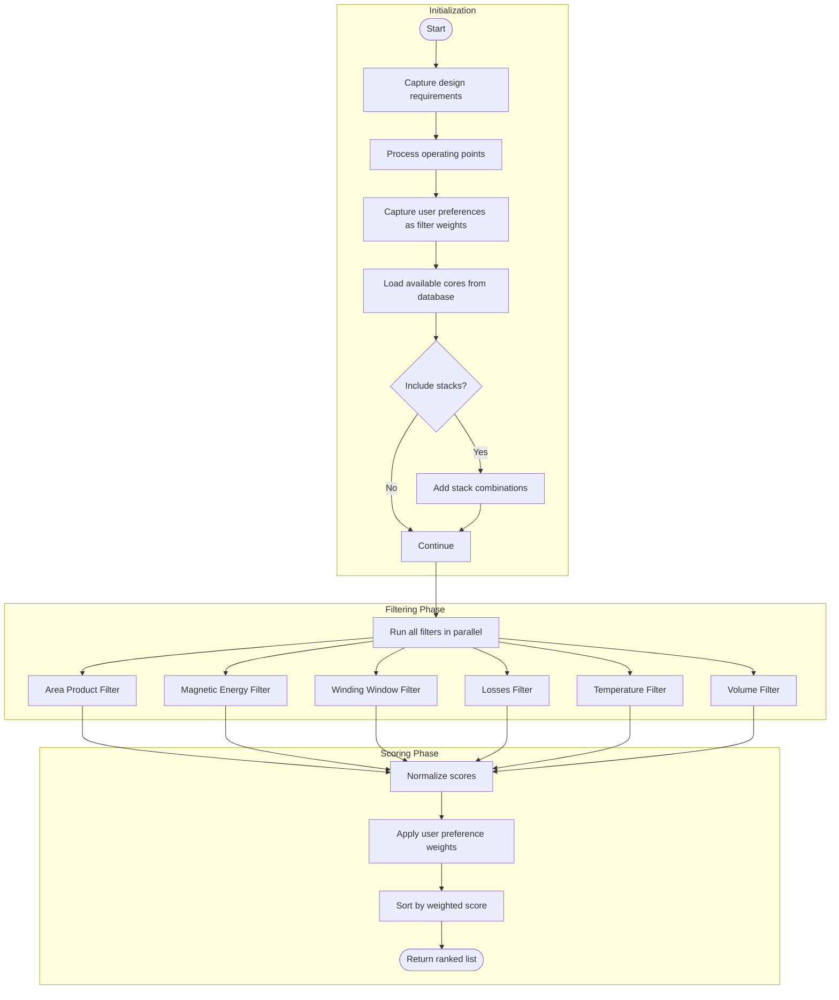

# Core Adviser

The Core Adviser helps find optimal magnetic cores for your design requirements by filtering and scoring candidates from the database.

## Overview

The Core Adviser applies multiple filters to narrow down the search space, then scores and ranks the remaining candidates based on weighted criteria.



## Filters

### Area Product Filter

Estimates the required core area product (Ap = Ac × Wa) based on power handling requirements.

**Algorithm:**

1. Calculate effective skin depth at operating frequency
2. Estimate instantaneous power from voltage/current
3. Create virtual wire with radius equal to skin depth
4. Interpolate wire dimensions from commercial wire database
5. Calculate required area product using:

$$A_p = \frac{P \cdot K_a}{K_u \cdot J \cdot B_{max} \cdot f}$$

Where:
- P = instantaneous power
- Ka = area factor for number of windings
- Ku = utilization factor
- J = current density (default: 7 A/mm²)
- Bmax = maximum flux density
- f = frequency

**Score:** Distance from required area product (smaller is better)

### Magnetic Energy Filter

Ensures the core can store the required magnetic energy in its gap(s).

**Algorithm:**

1. Calculate required energy: $E = \frac{1}{2}LI^2$
2. For each core candidate:
   - Calculate core material reluctance
   - Calculate gap reluctance
   - Compute maximum storable energy
3. Discard cores with insufficient energy capacity

**Score:** Distance from required energy (smaller is better)

### Winding Window Area Filter

Verifies that windings will fit in the available window area.

**Algorithm:**

1. Calculate required turns for inductance
2. Estimate wire area based on skin depth
3. Calculate total winding area needed
4. Compare with available bobbin window
5. Estimate number of layers and manufacturability

**Score:** Manufacturability metric based on:
- Window filling factor
- Number of layers
- Core type complexity
- Stack configuration

### Losses Filter

Estimates total losses and filters cores exceeding threshold.

**Algorithm:**

1. Calculate minimum turns for inductance
2. Sweep turn count combinations to find minimum losses:
   - Calculate magnetizing inductance
   - Calculate magnetic flux density
   - Estimate core losses
   - Estimate winding DC and skin effect losses
3. Discard cores with losses > 5% of input power

**Score:** Total estimated losses (lower is better)

### Temperature Filter

Ensures core temperature stays within material limits.

**Algorithm:**

1. Calculate core losses
2. Estimate core temperature using thermal model
3. Compare with material maximum temperature
4. Discard cores that would overheat

**Score:** Estimated operating temperature (lower is better)

### Volume Filter

Simple filter that scores by total core volume.

**Score:** Core volume (smaller is better for miniaturization)

## Configuration

### Settings

```cpp
auto& settings = OpenMagnetics::Settings::GetInstance();

// Include core stacking combinations
settings.set_core_adviser_include_stacks(true);

// Include distributed gap configurations
settings.set_core_adviser_include_distributed_gaps(true);

// Enable intermediate pruning (reduces memory usage)
settings.set_core_adviser_enable_intermediate_pruning(true);

// Maximum candidates to keep after filtering
settings.set_core_adviser_maximum_magnetics_after_filtering(1000);

// Include margin tape in designs
settings.set_core_adviser_include_margin(false);
```

### Filter Weights

Customize the importance of each criterion:

```cpp
OpenMagnetics::CoreAdviser adviser;

// Set weights (0.0 to 1.0)
std::map<std::string, double> weights;
weights["area_product"] = 0.3;
weights["energy"] = 0.2;
weights["winding_window"] = 0.2;
weights["losses"] = 0.2;
weights["volume"] = 0.1;

adviser.set_weights(weights);
```

## Usage Example

```cpp
#include "OpenMagnetics.h"

int main() {
    // Define design requirements
    MAS::DesignRequirements requirements;
    requirements.set_magnetizing_inductance(100e-6);  // 100 µH
    requirements.set_maximum_voltage(400);
    requirements.set_maximum_current(2.5);

    // Define operating point
    MAS::OperatingPoint operatingPoint;
    MAS::OperatingConditions conditions;
    conditions.set_ambient_temperature(40);
    operatingPoint.set_conditions(conditions);

    MAS::OperatingPointExcitation excitation;
    excitation.set_frequency(100000);  // 100 kHz
    operatingPoint.set_excitations_per_winding({excitation});

    // Run adviser
    OpenMagnetics::CoreAdviser adviser;
    auto cores = adviser.get_advised_core(requirements, operatingPoint, 20);

    // Display results
    for (size_t i = 0; i < cores.size(); ++i) {
        std::cout << i+1 << ". " << cores[i].get_name() << std::endl;
    }

    return 0;
}
```

## Intermediate Pruning

When `core_adviser_enable_intermediate_pruning` is enabled, the adviser prunes candidates between filter stages to manage memory and computation time. This is particularly useful when searching large core databases.

The pruning keeps the top N candidates after each filter, where N is configured by `core_adviser_maximum_magnetics_after_filtering`.
