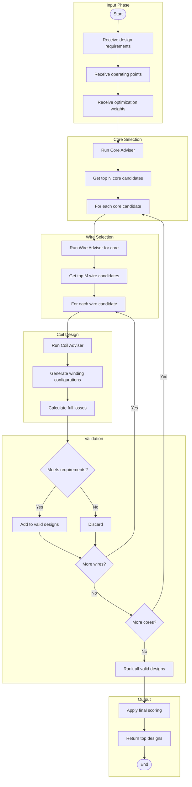

# Magnetic Adviser

The Magnetic Adviser is the top-level optimization tool that combines Core Adviser, Wire Adviser, and Coil Adviser to find complete magnetic component designs.

## Overview

The Magnetic Adviser orchestrates the entire design process, exploring combinations of cores, wires, and winding configurations to find optimal solutions.



## Features

### Multi-Objective Optimization

The Magnetic Adviser balances multiple objectives:

- **Efficiency**: Minimize total losses (core + winding)
- **Size**: Minimize volume and weight
- **Cost**: Consider material and manufacturing costs
- **Thermal**: Ensure temperature limits are met
- **Manufacturability**: Prefer simpler winding patterns

### Design Space Exploration

The adviser systematically explores:

1. Core shapes and sizes
2. Core materials
3. Gap configurations (single, distributed)
4. Wire types and gauges
5. Winding arrangements
6. Interleaving patterns

### Constraint Handling

Hard constraints that must be satisfied:
- Maximum temperature
- Minimum inductance
- Isolation voltage requirements
- Physical fit in available space

Soft constraints that influence scoring:
- Target efficiency
- Preferred manufacturers
- Available inventory

## Configuration

### Settings

```cpp
auto& settings = OpenMagnetics::Settings::GetInstance();

// Core selection
settings.set_core_adviser_include_stacks(true);
settings.set_core_adviser_include_distributed_gaps(true);
settings.set_use_toroidal_cores(true);
settings.set_use_concentric_cores(true);
settings.set_use_only_cores_in_stock(false);

// Wire selection
settings.set_wire_adviser_include_litz(true);
settings.set_wire_adviser_include_round(true);
settings.set_wire_adviser_include_rectangular(true);

// Coil configuration
settings.set_coil_allow_margin_tape(true);
settings.set_coil_allow_insulated_wire(true);
```

### Optimization Weights

```cpp
OpenMagnetics::MagneticAdviser adviser;

// Set optimization priorities
std::map<std::string, double> weights;
weights["efficiency"] = 0.4;    // Prioritize low losses
weights["volume"] = 0.2;        // Consider size
weights["cost"] = 0.2;          // Consider cost
weights["temperature"] = 0.2;   // Consider thermal

adviser.set_weights(weights);
```

## Usage Example

```cpp
#include "OpenMagnetics.h"

int main() {
    // Define design requirements
    MAS::DesignRequirements requirements;
    requirements.set_magnetizing_inductance(500e-6);  // 500 µH
    requirements.set_maximum_voltage(400);
    requirements.set_maximum_current(10);
    requirements.set_isolation_voltage(3000);  // 3 kV

    // Turns ratios for transformer
    requirements.set_turns_ratios({1.0, 0.25});  // 4:1

    // Define operating points
    MAS::OperatingPoint operatingPoint;
    MAS::OperatingConditions conditions;
    conditions.set_ambient_temperature(40);
    operatingPoint.set_conditions(conditions);

    // Primary excitation
    MAS::OperatingPointExcitation primaryExcitation;
    primaryExcitation.set_frequency(100000);

    MAS::SignalDescriptor primaryCurrent;
    MAS::Processed processed;
    processed.set_peak(10);
    processed.set_rms(7);
    primaryCurrent.set_processed(processed);
    primaryExcitation.set_current(primaryCurrent);

    // Secondary excitation
    MAS::OperatingPointExcitation secondaryExcitation;
    secondaryExcitation.set_frequency(100000);

    operatingPoint.set_excitations_per_winding({primaryExcitation, secondaryExcitation});

    // Run magnetic adviser
    OpenMagnetics::MagneticAdviser adviser;
    auto designs = adviser.get_advised_magnetic(requirements, operatingPoint, 10);

    // Display results
    std::cout << "Top magnetic designs:" << std::endl;
    for (size_t i = 0; i < designs.size(); ++i) {
        auto& design = designs[i];
        std::cout << "\nDesign " << i + 1 << ":" << std::endl;
        std::cout << "  Core: " << design.get_core().get_name() << std::endl;
        std::cout << "  Material: " << design.get_core().get_material_name() << std::endl;
        std::cout << "  Primary turns: " << design.get_coil().get_turns(0) << std::endl;
        std::cout << "  Wire: " << design.get_wire(0).get_name() << std::endl;
        std::cout << "  Estimated efficiency: " << design.get_efficiency() * 100 << "%" << std::endl;
    }

    return 0;
}
```

## Output Structure

Each design returned by the Magnetic Adviser includes:

```cpp
struct MagneticDesign {
    Core core;                      // Selected core
    Coil coil;                      // Winding configuration
    std::vector<Wire> wires;        // Wire per winding
    double total_losses;            // Estimated total losses (W)
    double core_losses;             // Core losses (W)
    double winding_losses;          // Winding losses (W)
    double efficiency;              // Calculated efficiency
    double temperature_rise;        // Estimated temperature rise (°C)
    double score;                   // Optimization score
    std::map<std::string, double> breakdown;  // Detailed scoring breakdown
};
```

## Performance Considerations

The Magnetic Adviser performs extensive calculations. To optimize runtime:

1. **Limit search space**: Use settings to exclude unlikely candidates
2. **Enable pruning**: `set_core_adviser_enable_intermediate_pruning(true)`
3. **Limit results**: Request only the number of designs you need
4. **Use stock filter**: `set_use_only_cores_in_stock(true)` to limit to available parts

```cpp
// Fast search configuration
auto& settings = OpenMagnetics::Settings::GetInstance();
settings.set_core_adviser_enable_intermediate_pruning(true);
settings.set_core_adviser_maximum_magnetics_after_filtering(100);
settings.set_coil_adviser_maximum_number_wires(50);
settings.set_use_only_cores_in_stock(true);
```
