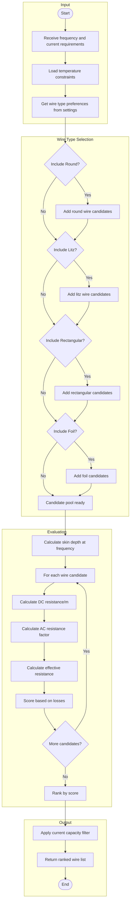

# Wire Adviser

The Wire Adviser selects optimal wire types and dimensions for a given operating frequency and current, minimizing AC resistance while considering manufacturing constraints.

## Overview

Wire selection significantly impacts winding losses at high frequencies due to skin and proximity effects. The Wire Adviser evaluates different wire types and finds the best match for your requirements.



## Wire Types

### Round Wire

Standard solid copper wire. Best for:
- Low frequencies (< 50 kHz)
- Low current applications
- Cost-sensitive designs

**Skin depth consideration:**
$$\delta = \sqrt{\frac{\rho}{\pi \mu f}}$$

Effective when wire radius < 2δ.

### Litz Wire

Multiple individually insulated strands twisted together. Best for:
- Medium to high frequencies (50 kHz - 2 MHz)
- Moderate to high currents
- Applications requiring low AC resistance

**Strand selection:**
- Strand diameter should be < 2δ
- More strands = better high-frequency performance
- Trade-off with fill factor and cost

### Rectangular Wire

Flat copper conductors. Best for:
- High current, low frequency
- Planar transformers
- Applications requiring high fill factor

**Considerations:**
- Higher proximity effect than round wire
- Better thermal performance
- Limited flexibility for toroidal cores

### Foil Wire

Thin copper foil. Best for:
- Very high currents
- Planar inductors
- Single-layer windings

## Configuration

### Settings

```cpp
auto& settings = OpenMagnetics::Settings::GetInstance();

// Enable/disable wire types
settings.set_wire_adviser_include_round(true);
settings.set_wire_adviser_include_litz(true);
settings.set_wire_adviser_include_rectangular(true);
settings.set_wire_adviser_include_foil(false);
settings.set_wire_adviser_include_planar(false);

// Allow rectangular wire in toroidal cores
settings.set_wire_adviser_allow_rectangular_in_toroidal_cores(false);
```

## Usage Example

```cpp
#include "OpenMagnetics.h"

int main() {
    // Operating conditions
    double frequency = 200000;  // 200 kHz
    double rms_current = 5.0;   // 5 A RMS
    double temperature = 40;    // 40°C

    // Run wire adviser
    OpenMagnetics::WireAdviser adviser;
    auto wires = adviser.get_advised_wire(frequency, rms_current, temperature, 20);

    std::cout << "Wire recommendations for " << frequency/1000 << " kHz, "
              << rms_current << " A:" << std::endl;

    for (size_t i = 0; i < std::min(wires.size(), size_t(5)); ++i) {
        auto& wire = wires[i];
        std::cout << i+1 << ". " << wire.get_name();

        auto type = wire.get_type();
        if (type == MAS::WireType::LITZ) {
            std::cout << " (Litz, " << wire.get_number_conductors().value()
                      << " x " << wire.get_strand_diameter().value() * 1e6 << " µm)";
        } else if (type == MAS::WireType::ROUND) {
            std::cout << " (Round, " << wire.get_conducting_diameter().value() * 1e3 << " mm)";
        }
        std::cout << std::endl;
    }

    return 0;
}
```

## Skin Depth Reference

| Frequency | Skin Depth (Copper, 25°C) |
|-----------|---------------------------|
| 10 kHz    | 0.66 mm                   |
| 50 kHz    | 0.30 mm                   |
| 100 kHz   | 0.21 mm                   |
| 200 kHz   | 0.15 mm                   |
| 500 kHz   | 0.09 mm                   |
| 1 MHz     | 0.07 mm                   |

## Litz Wire Selection Guide

For optimal litz wire selection:

1. **Strand diameter**: Should be approximately equal to skin depth
2. **Number of strands**: Based on current capacity
3. **Construction**: Consider twist pitch and bundle configuration

```cpp
// Example: Finding optimal litz configuration
double frequency = 100000;  // 100 kHz
double skin_depth = OpenMagnetics::calculate_skin_depth(frequency, 25.0);

// Strand diameter should be ~2x skin depth for round strands
double optimal_strand_diameter = 2 * skin_depth;

std::cout << "Optimal strand diameter: " << optimal_strand_diameter * 1e6 << " µm" << std::endl;
```

## AC Resistance Factor

The AC resistance factor (Fr) represents the increase in resistance due to skin and proximity effects:

$$F_r = \frac{R_{AC}}{R_{DC}} = F_{skin} + F_{proximity}$$

Typical values:
- Well-designed litz: Fr ≈ 1.1 - 1.5
- Round wire at f > skin depth: Fr ≈ 2 - 10
- Foil with proper thickness: Fr ≈ 1.5 - 3
