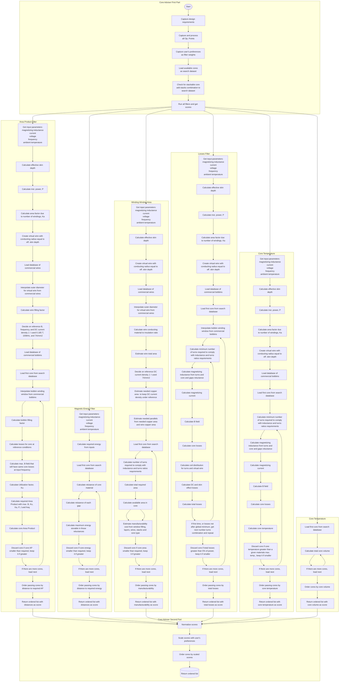

```mermaid
flowchart TD
    subgraph "Core Adviser First Part"
        0A([Start]) --> 0B[Capture design requirements]
        0B --> 0C[Capture and process \n all Op. Points]
        0C --> 0D[Capture user's preferences\n as filter weights]
        0D --> 0E[Load available cores\n as search dataset]
        0E --> 0F[Check for stackable core\nadd stacks combination to\nsearch dataset]
        0F --> 0G[Run all filters and get scores]
    end
    subgraph "Area Product Filter"
        0G --> 1A[Get input parameters:\nmagnetizing inductance\ncurrent\nvoltage\nfrequency\nambient temperature]
        1A --> 1B[Calculate effective skin depth]
        1B --> 1C[Calculate inst. power, P]
        1C --> 1D[Calculate area factor due to number of windings, Ka]
        1D --> 1E[Create virtual wire with conducting radius equal to eff. skin depth]
        1E --> 1F[Load database of commercial wires]
        1F --> 1G[Interpolate outer diameter for virtual wire from commercial wires]
        1G --> 1H[Calculate wire filling factor]
        1H --> 1I[Decide on reference B, frequency, and DC current density J. I used 0.185 T, 100kHz, and 7A/mm2]
        1I --> 1J[Load database of commercial bobbins]
        1J --> 1K[Load first core from search database]
        1K --> 1L[Interpolate bobbin winding window from commercial bobbins]
        1L --> 1M[Calculate bobbin filling factor]
        1M --> 1N[Calculate losses for core at reference conditions]
        1N --> 1O[Calculate max. B field that will have same core losses at input frequency]
        1O --> 1P[Calculate Utilization factor, Ku]
        1P --> 1Q[Calculate required Area Product with max. B, Ku, Ka, P, J and freq]
        1Q --> 1R[Calculate core Area Product]
        1R --> 1S[Discard core if core AP smaller than required, keep it if greater]
        1S --> 1T[If there are more cores, load next]
        1T --> 1L
        1T --> 1U[Order passing cores by distance to required AP]
        1U --> 1V[Return ordered list with distances as score]
    end
    subgraph "Magnetic Energy Filter"
        0G --> 2A[Get input parameters:\nmagnetizing inductance\ncurrent\nvoltage\nfrequency\nambient temperature]
        2A --> 2B[Calculate required energy from inputs]
        2B --> 2J[Load first core from search database]
        2J --> 2K[Calculate relutance of core material]
        2K --> 2L[Calculate relutance of each gap]
        2L --> 2M[Calculate maximum energy storable in those reluctances]
        2M --> 2R[Discard core if core energy smaller than required, keep it if greater]
        2R --> 2S[If there are more cores, load next]
        2S --> 2K
        2S --> 2T[Order passing cores by distance to required energy]
        2T --> 2U[Return ordered list with distances as score]

    end

    subgraph "Winding Window Area"
        0G --> 3A[Get input parameters:\nmagnetizing inductance\ncurrent\nvoltage\nfrequency\nambient temperature]
        3A --> 3B[Calculate effective skin depth]
        3B --> 3E[Create virtual wire with conducting radius equal to eff. skin depth]
        3E --> 3F[Load database of commercial wires]
        3F --> 3G[Interpolate outer diameter for virtual wire from commercial wires]
        3G --> 3H[Calculate wire conducting material to insulation ratio]
        3H --> 3I[Estimate wire total area]
        3I --> 3J[Decide on reference DC current density J. I used 7A/mm2]
        3J --> 3K[Estimate needed copper area  to keep DC current density under reference]
        3K --> 3L[Estimate needed parallels from needed copper area and wire copper area]
        3L --> 3M[Load first core from search database]

        3M --> 3N[Calculate number of turns required to comply with inductance and turns ratios requirements]
        3N --> 3O[Calculate total required area]
        3O --> 3P[Calculate available area in core]
        3P --> 3Q[Estimate needed layers]
        3P --> 3Q[Estimate manufacturability cost from window filling, layers, wires, stacks and core type]
        3Q --> 3R[Discard core if core area smaller than required, keep it if greater]
        3R --> 3S[If there are more cores, load next]
        3S --> 3M
        3S --> 3T[Order passing cores by manufacturability]
        3T --> 3U[Return ordered list with manufacturability as score]
    end
    subgraph "Losses Filter"
        0G --> 4A[Get input parameters:\nmagnetizing inductance\ncurrent\nvoltage\nfrequency\nambient temperature]
        4A --> 4B[Calculate effective skin depth]
        4B --> 4C[Calculate inst. power, P]
        4C --> 4D[Calculate area factor due to number of windings, Ka]
        4D --> 4E[Create virtual wire with conducting radius equal to eff. skin depth]
        4E --> 4F[Load database of commercial bobbins]
        4F --> 4G[Load first core from search database]
    
        4G --> 4H[Interpolate bobbin winding window from commercial bobbins]
        4H --> 4I[Calculate minimum number of turns required to comply with inductance and turns ratios requirements]
        4I --> 4J[Calculate magnetizing inductance from turns and core and gaps reluctance]
        4J --> 4K[Calculate magnetizing current]
        4K --> 4L[Calculate B field]
        4L --> 4M[Calculate core losses]
        4M --> 4N[Calculate coil distribution for turns and virtual wire]
        4N --> 4O[Calculate DC and skin effect losses]
        4O --> 4P[Calculate total losses]
        4P --> 4Q[If first time, or losses not after global minimum, get next number turns combination and repeat]
        4Q --> 4I
        4Q --> 4T[Discard core if total losses greater than 5% of power, keep it if smaller]
        4T --> 4U[If there are more cores, load next]
        4U --> 4H
        4U --> 4V[Order passing cores by total losses]
        4V --> 4W[Return ordered list with total losses as score]
    end
    subgraph "Core Temperature"
        0G --> 5A[Get input parameters:\nmagnetizing inductance\ncurrent\nvoltage\nfrequency\nambient temperature]
        5A --> 5B[Calculate effective skin depth]
        5B --> 5C[Calculate inst. power, P]
        5C --> 5D[Calculate area factor due to number of windings, Ka]
        5D --> 5E[Create virtual wire with conducting radius equal to eff. skin depth]
        5E --> 5F[Load database of commercial bobbins]
        5F --> 5G[Load first core from search database]
        5G --> 5I[Calculate minimum number of turns required to comply with inductance and turns ratios requirements]
        5I --> 5J[Calculate magnetizing inductance from turns and core and gaps reluctance]
        5J --> 5K[Calculate magnetizing current]
        5K --> 5L[Calculate B field]
        5L --> 5M[Calculate core losses]
        5M --> 5N[Calculate core temperature]
        5N --> 5T[Discard core if core temperature greater than a given materials max. temp., keep it if smaller]
        5T --> 5U[If there are more cores, load next]
        5U --> 5I
        5U --> 5V[Order passing cores by core temperature]
        5V --> 5W[Return ordered list with core temperature as score]
    end
    subgraph "Core Temperature"
        0G --> 6G[Load first core from search database]
        6G --> 6I[Calculate total core volume]
        6I --> 6U[If there are more cores, load next]
        6U --> 6I
        6U --> 6V[Order cores by core volume]
        6V --> 6W[Return ordered list with core volume as score]
    end
    subgraph "Core Adviser Second Part"
        1V --> 0H
        2U --> 0H
        3U --> 0H
        4W --> 0H
        5W --> 0H
        6W --> 0H
        0H[Normalize scores]
        0H --> 0I[Scale scores with user's preferences]
        0I --> 0J[Order cores by scaled scores]
        0J --> 0K[(Return ordered list)]
    end
```